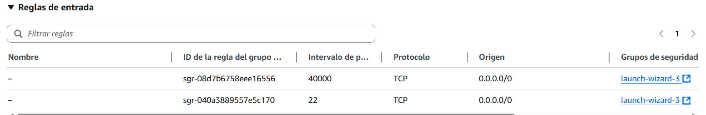
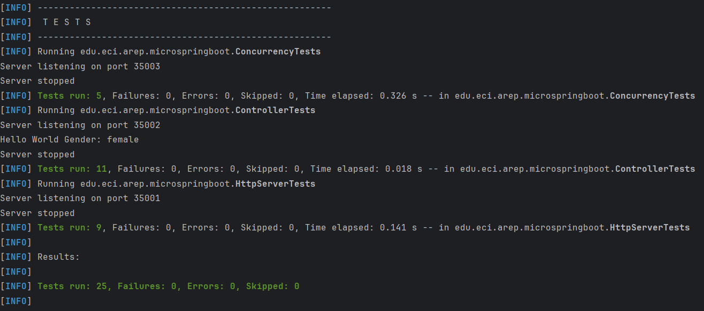

# Taller de de modularización con virtualización e Introducción a Docker

## Introducción

El presente taller tiene como propósito integrar y desplegar, dentro de un contenedor **Docker**, 
el microframework web desarrollado en trabajos previos. 
Dicho microframework ha sido mejorado para soportar múltiples solicitudes concurrentes mediante el uso de hilos, 
así como para permitir un apagado controlado y “elegante”.

Como parte del ejercicio, se construye una **imagen Docker** que encapsula la aplicación 
y se publica en un repositorio en **Docker Hub**, con el fin de facilitar su distribución y reutilización. 
Finalmente, se configura una máquina virtual en **AWS**, en la cual se instala Docker y se despliega el contenedor, 
validando así el funcionamiento de la aplicación en un entorno de nube.


## Arquitectura

### Diagrama de clases

El siguiente diagrama de clases representa la estructura interna del microframework 
web. En él se ilustran las clases principales que lo componen, 
sus atributos y métodos más relevantes, 
así como las relaciones que existen entre ellas.


### Diagrama de componentes 

La siguiente figura ilustra los componentes principales de la aplicación, 
sus responsabilidades y las relaciones entre ellos.


### HttpRequest
Encapsula la información de la solicitud HTTP recibida. Gestiona la URI y los parámetros de consulta 
que vienen anotadas `@RequestParam`.
### HttpResponse
Modela la respuesta HTTP que será enviada al cliente, se encarga de tener el estado y código de respuesta HTTP (`200 OK`,`400 Bad Request`,etc.),
los encabezados (`Content-Type`,`Content-Lenght`, etc) y el cuerpo a enviar.
### HttpServer
Es el núcleo del framework, se encarga principalmente de:

* Configurar el classpath mediante `setClassPath("ruta.del.paquete")`.
* Detectar automáticamente las clases anotadas con `@RestController` y, a partir de ellas, registrar
los métodos que tienen la anotación `@GetMapping` y almacenar la ruta de la anotación
`@RequestMapping`.

* Servir archivos estáticos (HTML, CSS, JS, imágenes) desde un directorio configurado mediante `staticfiles(path)`.

* Procesar las solicitudes HTTP entrantes y construir la respuesta final.

* Controlar errores comunes (400,404, 500, 405) y generar respuestas acordes.

* Gestionar múltiples solicitudes de manera simultánea utilizando hilos, permitiendo iniciar la atención concurrente de clientes 
y ofrecer un apagado controlado del servidor.

## Funcionamiento

### Concurrencia

El servidor HTTP fue mejorado para soportar múltiples solicitudes de manera simultánea, implementando la interfaz `Runnable`.

Para garantizar un control seguro del estado y evitar condiciones de carrera, 
se utilizaron tipos atómicos como `AtomicBoolean`, 
los cuales permiten realizar operaciones indivisibles sobre valores compartidos 
sin necesidad de bloqueos explícitos.

Además, se incorporó un `ThreadPoolExecutor` configurado de la siguiente manera:

```
this.executor = new ThreadPoolExecutor(
            nThreads, nThreads,
            0L, TimeUnit.MILLISECONDS,
            new ArrayBlockingQueue<>(capacity),
            new ThreadFactory() {
                private final ThreadFactory delegate = Executors.defaultThreadFactory();
                private int idx = 0;
                @Override public Thread newThread(Runnable r) {
                    Thread t = delegate.newThread(r);
                    t.setName("http-worker-" + (++idx));
                    t.setDaemon(false);
                    return t;
                }
            },
            new ThreadPoolExecutor.CallerRunsPolicy()
        );

```

Este diseño proporciona un mecanismo eficiente para reutilizar hilos y manejar múltiples solicitudes sin la sobrecarga de crear un hilo nuevo por cada cliente.
Los parámetros principales permiten ajustar el comportamiento del grupo de hilos:

* corePoolSize y maximumPoolSize: número mínimo y máximo de hilos activos (en este caso se definen iguales para mantener un pool fijo).

* keepAliveTime: tiempo de espera para hilos inactivos (0 en este caso, ya que los hilos se mantienen siempre activos).

* workQueue (BlockingQueue): cola donde se almacenan las tareas pendientes hasta que un hilo esté disponible.

* RejectedExecutionHandler: política aplicada cuando la cola está llena (en este caso, el hilo que envía la tarea la ejecuta directamente).

#### Ciclo de vida del servidor

El ciclo de vida del servidor se controla con los métodos `run()` y `stop()`.

* El método `run()` inicializa el servidor, acepta conexiones entrantes y delega cada solicitud a un hilo del pool.

* El método `stop()` detiene el socket de escucha y coordina un apagado controlado, asegurando que las tareas activas finalicen correctamente.

### Docker

Docker es una herramienta para empaquetar aplicaciones y sus dependencias
en contenedores. 
Permite crear, probar y desplegar aplicaciones rápidamente, 
garantizando que el código funcione igual en el entorno local, 
de pruebas o en la nube.

Se construyó una imagen Docker a partir del microframework desarrollado previamente, 
y a partir de dicha imagen se levantaron tres contenedores. 
Posteriormente, la imagen fue publicada en un repositorio en Docker Hub.

#### Pasos para crear una imagen Docker y desplegarla

1. Compilar la aplicación

```
mvn clean package
```
2. Asegurarse que la aplicación esté ejecutando 

```
java -cp "target/classes;target/dependency/*" edu.eci.arep.microspringboot.MicroSpringBoot
```

3. Crear archivo `Dockerfile` en la raíz del proyecto

```
FROM openjdk:21

WORKDIR /usrapp/bin

ENV PORT=6000

COPY /target/classes /usrapp/bin/classes
COPY /target/dependency /usrapp/bin/dependency

CMD ["java","-cp","./classes:./dependency/*","edu.eci.arep.microspringboot.MicroSpringBoot"]
```

4. Construir la imagen

```
docker build --tag dockertallerarep .
```

5. Ejecutar contenedores a partir de la imagen

```
docker run -d -p 34000:6000 --name arepdockercontainer dockertallerarep
docker run -d -p 34001:6000 --name arepdockercontainer2 dockertallerarep
docker run -d -p 34002:6000 --name arepdockercontainer3 dockertallerarep  
```

Este comando mapea el puerto 6000 del contenedor (donde escucha el microframework) al puerto especificado del host,
en este caso 34000, 34001, 34002.

6. Verificar que los contenedores estén en ejecución

```
docker ps
```

7. Acceder al browser por el puerto de los contenedores y asegurarse que la
aplicación está funcionando

`http://localhost:34000/`, `http://localhost:34001/` , `http://localhost:34002/`


8. Crear el archivo `docker-compose.yml` en la raíz del proyecto para generar automáticamente una configuración docker

```
version: '2'
services:
  web:
    build:
      context: .
      dockerfile: Dockerfile
    container_name: web
    ports:
      - "8087:6000"
  db:
    image: mongo:3.6.1
    container_name: db
    volumes:
      - mongodb:/data/db
      - mongodb_config:/data/configdb
    ports:
      - 27017:27017
    command: mongod

volumes:
  mongodb:
  mongodb_config:
```

Con este archivo de ejemplo se definen dos servicios:

* web: construye la aplicación desde el Dockerfile y expone el puerto interno 6000 en el 8087 del host.

* db: levanta un contenedor de MongoDB, con volúmenes para persistencia de datos y el puerto estándar 27017.

9. Ejecutar el docker compose

```
docker-compose up -d 
```

10. Verificar que se crearon los servicios con `docker ps`
11. Crear repositorio en `docker hub` y crear una referencia a la imagen con el nombre del repositorio a donde se
va a subir

```
docker tag dockertallerarep camilatorres0812/taller4_arep
```

12. Verificar la nueva referencia a la imagen

```
docker images
```

13. Autenticarse con una cuenta Docker 

```
docker login
```

14. Subir la imagen al repositorio

```
docker push camilatorres0812/taller4_arep:latest
```


### Instancia EC2 en AWS

La siguiente imagen ilustra el despliegue del microframework en AWS utilizando Docker:


Para el acceso externo, se creó una instancia EC2 en AWS y se configuraron las reglas de entrada del Security Group, habilitando el puerto `40000`:



Una vez definida la regla, se realiza el mapeo del puerto 40000 del host hacia el puerto 6000 del contenedor, donde la aplicación escucha.

Este mapeo se realizó ejecutando el siguiente comando en la máquina EC2:

```
docker run -d -p 40000:6000 --name firstdockerimageaws camilatorres0812/taller4_arep
```

Accedemos desde el browser utilizando la URL pública de la instancia EC2:


## Primeros Pasos

### Prerrequisitos

Antes de comenzar, es necesario tener instalado lo siguiente en el entorno:

* **Java Development Kit (JDK) 21 o superior**

  [Descargar JDK](https://www.oracle.com/java/technologies/javase/jdk21-archive-downloads.html)

  Verifica la versión

    ```
    java -version
    ```
* **Maven**

  Construcción de gestión de dependencias -
  [Instalar Maven](https://maven.apache.org/download.cgi)

  Verifica la instalación 

    ```
    mvn -version
    ```

* **Git**

  Control de versiones -
  [Descargar Git](https://git-scm.com/downloads)

  Verifica la instalación

    ```
    git -version
    ```
  
* **Docker Desktop**

  Crear, ejecutar y administrar contenedores - [Descargar Docker](https://docs.docker.com/get-started/get-docker/)

    Verifica la instalación

    ```
    docker -version
    ```

### Instalación

1. Clonar el repositorio
    ```
    git clone https://github.com/CamilaTorres08/Taller3_AREP.git
    cd Taller3_AREP
    ```
2. Compilar el proyecto
    ```
    mvn clean install
    ```
3. Ejecutar el servidor

    3.1. 

    ```
    mvn exec:java
    ```
    3.2.
    ```
    java -cp "target/classes;target/dependency/*" edu.eci.arep.microspringboot.MicroSpringBoot
    ```
   O directamente en la IDE dando clic en *Run* sobre el archivo `MicroSpringBoot`
  
4. Abrir la aplicación en el navegador 
    ```
    http://localhost:35000
    ```
   
5. Si prefiere usar un contenedor, siga las instrucciones indicadas en la sección de [funcionamiento](#docker)

## Pruebas
### Pruebas manuales

https://github.com/user-attachments/assets/786bea74-c67b-47cd-aaaa-d7db25b26bb5

### Pruebas automáticas
Se incluye pruebas con JUnit para validar el funcionamiento del framework.
Los archivos de pruebas se encuentran en: 

`src/test/java/edu/eci/arep/microspringboot/HttpServerTests.java`

`src/test/java/edu/eci/arep/microspringboot/ControllerTests.java`

`src/test/java/edu/eci/arep/microspringboot/ConcurrencyTests.java`

#### Ejecución de pruebas

* **Usando Maven**

    Ejecute todas las pruebas con el siguiente comando:
    ```
    mvn test
    ```
* **Usando la IDE**
    
    Abra los archivos `HttpServerTests`, `ControllerTests` y `ConcurrencyTests` y ejecute directamente las pruebas con el botón *Run Test*

#### Verificación

Se añadieron pruebas de concurrencia además de las pruebas implementadas en trabajos anteriores,
que validan la capacidad del servidor HTTP para manejar solicitudes concurrentes de manera segura y eficiente.
Estas pruebas permiten comprobar:

* Seguridad de hilos (Thread Safety): Sin condiciones de carrera o corrupción de datos
* Gestión de recursos: Pool de hilos y cola de solicitudes
* Rendimiento bajo carga: Tiempos de respuesta y tasas de éxito
* Resilencia del sistema: Recuperación después de picos de tráfico

Además, cubren aspectos críticos de un servidor HTTP concurrente:

* Manejo básico de hilos
* Procesamiento de lógica de negocio concurrente
* Gestión de recursos bajo carga
* Recuperación y resilencia
* Comportamiento en condiciones límite
* Validación de todos los endpoints REST




## Despliegue

### Ejecución local (desarrollo y pruebas)

Se puede levantar el servidor directamente con Maven o Java, como se describe en la sección de [Instalación](#instalación).
Esto permite probar la aplicación en `http://localhost:35000`.

### Despliegue con Docker

Se construyó una imagen Docker que empaqueta el microframework con todas sus dependencias.
La imagen se publica en Docker Hub y se puede ejecutar con:

```
docker run -d -p 42000:6000 --name [container] camilatorres0812/taller4_arep
```

Esto expone la aplicación en `http://localhost:42000`

## Tecnologías utilizadas

* [Java 21](https://openjdk.org/projects/jdk/21/) - Lenguaje de Programación
* [Maven](https://maven.apache.org/) - Compilaciones y dependencias
* [JUnit](https://junit.org/) - Framework de testeo

## Versionamiento

Actualmente se encuentra en desarrollo y se usa la versión por defecto.

## Autores

* **Andrea Camila Torres González** 

## Licencia

Este proyecto no cuenta actualmente con una licencia específica.  
Su uso está restringido únicamente a fines académicos.


