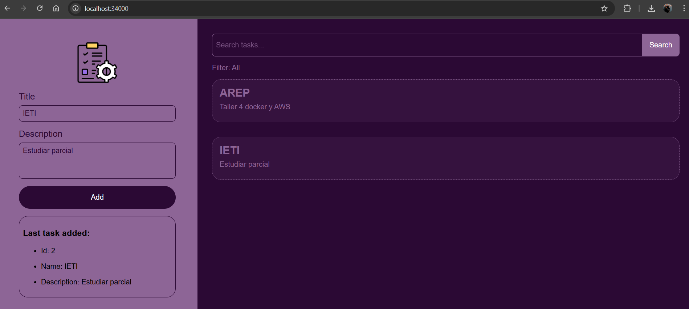
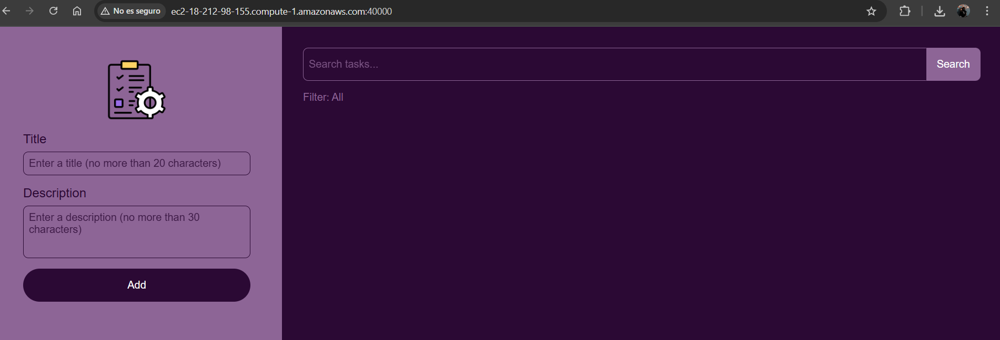

# Arquitecturas de Servidores de Aplicaciones, Meta protocolos de objetos, Patrón IoC, Reflexión

## Introducción

Este taller tiene como objetivo explorar las capacidades de **reflexión** en Java para la construcción de aplicaciones web. 
A través de la API de Reflexión es posible leer y manipular los metadatos de las clases, 
lo que nos permitirá utilizar dinámicamente la información de un **POJO (Plain Old Java Object)** como base para una aplicación.

El propósito es desarrollar un servidor web en Java, similar en concepto a servidores como Apache, capáz de:

* Servir archivos estáticos **HTML**,**CSS**,**JavaScript** e **Imágenes**
* Proveer un framework de Inversión de Control (IoC) que permita construir aplicaciones web a partir de POJOs.

Al finalizar, se contará con un prototipo mínimo que demuestra cómo Java, mediante sus capacidades reflexivas, puede cargar un bean
(POJO) y derivar una aplicación web a partir de él.


## Arquitectura
La siguiente figura ilustra los componentes principales, sus responsabilidades y las relaciones entre ellos.


### HttpRequest
Encapsula la información de la solicitud HTTP recibida. Gestiona la URI y los parámetros de consulta (`query params`).
### HttpResponse
Modela la respuesta HTTP que será enviada al cliente, se encarga de tener el estado y código de respuesta HTTP (`200 OK`,`400 Bad Request`,etc.),
los encabezados (`Content-Type`,`Content-Lenght`, etc) y el cuerpo a enviar.
### HttpServer
Es el núcleo del framework, se encarga principalmente de:

* Configurar el classpath mediante `setClassPath("ruta.del.paquete")`.
* Detectar automaticamente las clases anotadas con `@RestController` y, a partir de ellas, registrar
los valores de `@GetMapping` y `@RequestMapping`

  

  La anterior imagen muestra cómo el servidor almacena internamente las anotaciones:

  `Map<String,Map<String, Method>> services = new HashMap<>();`

  Donde la clave externa corresponde al valor de la anotación `@RequestMapping` y el valor es otro mapa que asocia
  el valor de la anotación `@GetMapping` con el método `Method` que debe ejecutarse cuando reciba la solicitud
  correspondiente.

* Servir archivos estáticos (HTML, CSS, JS, imágenes) desde un directorio configurado mediante `staticfiles(path)`.

* Procesar las solicitudes HTTP entrantes y construir la respuesta final.

* Gestionar errores comunes (400,404, 500, 405) y generar respuestas acordes.

## Funcionamiento

El framework permite definir **endpoints HTTP** (actualmente solo para solicitudes **GET**)
utilizando anotaciones que definen:
* La clase controladora `@RestController`
* La ruta base `@RequestMapping`
* El método de acceso `@GetMapping`
* Los parámetros de entrada `@RequestParam`

De esta manera, se puede crear servicios web a partir de POJOs.

### Definir un controlador 
Todo servicio debe estar contenido dentro de una clase anotada con
`@RestController` para indicar que la clase puede recibir y procesar solicitudes HTTP:

```
@RestController
public class GreetingController {}
```

### Configurar la ruta base  
Si se desea que el servicio sea accesible desde una ruta en específico, se usa la anotación 
`@RequestMapping("ruta")`:

```
@RestController
@RequestMapping("/greeting")
public class GreetingController {}
```
También es posible definir rutas más largas y jerárquicas:

```
@RestController
@RequestMapping("api/v1/greeting")
public class GreetingController {}
```

*Nota: Si no se define la anotación `@RequestMapping` o se deja sin valor, la ruta base
asignada por defecto será `/app`. Para evitar conflictos entre controladores, se recomienda
que cada clase `@RestController` defina su propia ruta base.*

### Definir métodos GET 
Cada endpoint **GET** se debe definir con la anotación `@GetMapping["ruta"]`:

```
@GetMapping("/void")
public static String defaultValue() {
    return "Hello World!";
}
```
*Nota: es obligatorio que se coloque esta anotación; sin embargo, se puede dejar el valor vacío, este asignará `/`*

### Recibir parámetros
Los métodos pueden aceptar parámetros en la **URL** mediante la anotación `@RequestParam`.

Debe especificarse:
* **value**: nombre del parámetro a recibir
* **defaultValue**: valor por defecto en caso de no recibir el parámetro

```
@GetMapping("/greeting")
public static String greeting(@RequestParam(value = "name", defaultValue = "World") String name) {
return "Hello " + name;
}
```
*Nota: Actualmente, solo se soportan parámetros de tipo **String***

### Tipos de respuesta soportados

El servidor, basándose en lo implementado en el [taller 2](https://github.com/CamilaTorres08/Taller2_AREP.git), es capaz 
de devolver `String`, `List<>`  y `Objetos personalizados` (instancias de clases definidas por el usuario; 
por ejemplo, las ubicadas en la carpeta `classes`) o vacío `void` en dicho caso el código de respuesta
será *204 No Content*.

## Primeros Pasos

### Prerrequisitos

Antes de comenzar, es necesario tener instalado lo siguiente en el entorno:

* **Java Development Kit (JDK) 21 o superior**

  [Descargar JDK](https://www.oracle.com/java/technologies/javase/jdk21-archive-downloads.html)

  Verifica la versión

    ```
    java -version
    ```
* **Maven**

  Construcción de gestión de dependencias -
  [Instalar Maven](https://maven.apache.org/download.cgi)

  Verifica la instalación 

    ```
    mvn -version
    ```

* **Git**

  Control de versiones -
  [Descargar Git](https://git-scm.com/downloads)

  Verifica la instalación

    ```
    git -version
    ```

### Instalación

1. Clonar el repositorio
    ```
    git clone https://github.com/CamilaTorres08/Taller3_AREP.git
    cd Taller3_AREP
    ```
2. Compilar el proyecto
    ```
    mvn clean install
    ```
3. Ejecutar el servidor
    ```
    mvn exec:java
    ```
   O directamente en la IDE dando clic en *Run* sobre el archivo `MicroSpringBoot`
  
4. Abrir la aplicación en el navegador 
    ```
    http://localhost:35000
    ```

## Pruebas
### Pruebas manuales
Para la ejecución de estas pruebas, se definieron controllers cuya implementación está en la carpeta `examples`

#### GreetingController
`http://localhost:35000/app/greeting`


`http://localhost:35000/app/greeting?name=Camila`



`http://localhost:35000/app/void`


`http://localhost:35000/app/params`



`http://localhost:35000/app/params?name=Juan&gender=male&age=20`


`http://localhost:35000/app/body`


#### TaskController

Al usar el buscador de la interfáz se realiza una petición a `http://localhost:35000/task?name=[value]`


`http://localhost:35000/task`


#### CalculatorController

`http://localhost:35000/v1/calculate/maths`


`http://localhost:35000/v1/calculate/maths?operation=*&a=4&b=20`


`http://localhost:35000/v1/calculate/maths/square?number=5`


#### Prueba de error
Se validan los casos en los que el servidor debe responder con error al no encontrar la ruta solicitada:
* **Ruta base inexistente**: solicitar un recurso con una ruta base no implementada
  
  
* **Ruta específica no válida**: se accede a una ruta base válida, pero con una ruta específica (método GET) que no existe dentro del controlador
  
  

### Pruebas automáticas
Se incluye pruebas con JUnit para validar el funcionamiento del framework.
Los archivos de pruebas se encuentran en: 

`src/test/java/edu/eci/arep/microspringboot/HttpServerTests.java`

`src/test/java/edu/eci/arep/microspringboot/ControllerTests.java`


#### Ejecución de pruebas

* **Usando Maven**

    Ejecute todas las pruebas con el siguiente comando:
    ```
    mvn test
    ```
* **Usando la IDE**
    
    Abra los archivos `HttpServerTests` y `ControllerTests` y ejecute directamente las pruebas con el botón *Run Test*

#### Verificación
Estas pruebas permiten comprobar que:
* El servidor carga y sirve correctamente archivos estáticos.
* Los controladores se detectan mediante las anotaciones correspondientes.
* Las anotaciones `@RequestMapping`, `@GetMapping` y `@RequestParam` funcionan de manera adecuada.
* Las rutas se asignan correctamente a los metodos del controlador.
* Los parámetros reciben el valor esperado o el valor por defecto en caso de no ser proporcionados.

Así, se agarantiza que el framework funcione de forma consistente y que las anotaciones sean interpretadas
correctamente.


## Despliegue

Este proyecto está previsto para ejecutarse localmente con fines de desarrollo y pruebas.

## Tecnologías utilizadas

* [Java 21](https://openjdk.org/projects/jdk/21/) - Lenguaje de Programación
* [Maven](https://maven.apache.org/) - Compilaciones y dependencias
* [JUnit](https://junit.org/) - Framework de testeo

## Versionamiento

Actualmente se encuentra en desarrollo y se usa la versión por defecto.

## Autores

* **Andrea Camila Torres González** 

## Licencia

Este proyecto no cuenta actualmente con una licencia específica.  
Su uso está restringido únicamente a fines académicos.


